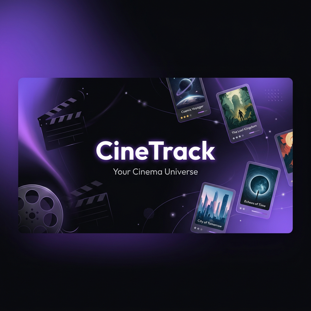

<p align="center">
  
</p>

<h1 align="center">🎬 CineTrack</h1>

<p align="center">
  <strong>Film ve dizi dünyasını keşfet, takip et, puanla.</strong>
</p>

<p align="center">
  <a href="#özellikler">Özellikler</a> •
  <a href="#teknoloji-yığını">Teknoloji</a> •
  <a href="#kurulum">Kurulum</a> •
  <a href="#proje-yapısı">Proje Yapısı</a> •
  <a href="#lisans">Lisans</a>
</p>

<p align="center">
  
  
  
  
  
  
</p>

---

## 📖 Hakkında

**CineTrack**, film ve dizi tutkunları için geliştirilmiş modern, hızlı ve kullanıcı dostu bir izleme takip uygulamasıdır. TMDB (The Movie Database) API kullanılarak oluşturulan bu proje ile en sevdiğiniz yapımları keşfedebilir, izleme listelerinizi yönetebilir, puanlayabilir ve oyuncular hakkında detaylı bilgilere ulaşabilirsiniz.

Kullanıcı verileri **Supabase** üzerinde güvenli bir şekilde saklanır. E-posta/şifre veya Google OAuth ile giriş yapılır ve tüm veriler hesabınıza bağlı olarak senkronize edilir.

---

## ✨ Özellikler

### 🔍 Keşif & Arama
- **Gelişmiş Arama** — Film ve dizileri anında arayın (debounced multi-search)
- **Trend İçerikler** — Haftalık trend filmler ve diziler
- **Türe Göre Keşif** — 8 farklı kategoride (Aksiyon, Komedi, Dram, Gerilim, Bilim Kurgu, Korku, Animasyon, Belgesel) içerik keşfedin
- **Kişiselleştirilmiş Öneriler** — Puanlarınıza ve izleme geçmişinize dayalı akıllı öneriler

### 📋 Koleksiyon Yönetimi
- **Koleksiyon (Watchlist)** — İzlemek istediğiniz yapımları kaydedin
- **İzlenenler** — İzlediğiniz yapımların kaydını tutun
- **Özel Listeler** — Sınırsız sayıda özelleştirilmiş liste oluşturun (renk ve açıklama ile)
- **Puanlama Sistemi** — 10 yıldızlı puanlama ile yapımları değerlendirin

### 🎬 İçerik Detayları
- **Film Detay Sayfaları** — Özet, oyuncu kadrosu, fragman, TMDB/IMDb/Rotten Tomatoes/Metacritic puanları
- **Dizi Detay Sayfaları** — Sezon & bölüm takibi, yayın durumu, ilerleme çubuğu
- **Oyuncu Profilleri** — Biyografi, filmografi, kişisel bilgiler
- **Nerede İzlenir?** — TMDB Watch Providers ile hangi platformlarda mevcut olduğunu görün

### ▶️ İzleme Deneyimi
- **Yerleşik Video Oynatıcı** — Çoklu kaynak desteği, otomatik failover
- **Altyazı Desteği** — OpenSubtitles API entegrasyonu, zamanlama ayarlama
- **Kaldığın Yerden Devam Et** — İzleme ilerlemesi otomatik kaydedilir
- **İzleme Geçmişi** — Tüm izleme geçmişinizi görüntüleyin ve yönetin
- **Reklam Engelleme** — Popup reklamlar otomatik olarak engellenir
- **X-Frame-Options Koruması** — Çalışmayan kaynaklar otomatik tespit edilip atlanır

### 👤 Profil & Hesap
- **Supabase Authentication** — E-posta/şifre veya Google OAuth ile giriş
- **Kullanıcı Profili** — Avatar emoji, kullanıcı adı, sinema kişiliği
- **Bildirim Ayarları** — Günlük izleme hatırlatıcıları
- **Yıl Sonu Özeti (Wrapped)** — İzleme alışkanlıklarınızın yıllık özeti
- **Profil Paylaşımı** — İzleme istatistiklerinizi kart olarak paylaşın

### 📅 Takvim & Takip
- **Yayın Takvimi** — Takip ettiğiniz dizilerin yeni bölüm tarihlerini görün
- **Dizi Takip** — Dizilerim sayfasında tüm takip edilen dizileri yönetin

### 🎨 Tasarım & UX
- **Sinematik Karanlık Tema** — Özel renk paleti (#7B5CF0 mor aksan)
- **Akıcı Animasyonlar** — Framer Motion ile sayfa geçişleri ve mikro-animasyonlar
- **Tam Responsive** — Mobil, tablet ve masaüstüne optimize
- **PWA Desteği** — Uygulamayı ana ekranınıza yükleyin
- **Offline Destek** — Service Worker ile çevrimdışı çalışma
- **Klavye Kısayolları** — Hızlı navigasyon (F: tam ekran, K: arama)

---

## 🛠️ Teknoloji Yığını

| Katman | Teknoloji |
|--------|-----------|
| **Framework** | [Next.js 14](https://nextjs.org/) (App Router) |
| **Dil** | [TypeScript 5](https://www.typescriptlang.org/) |
| **Stil** | [Tailwind CSS 3](https://tailwindcss.com/) |
| **Auth & Veritabanı** | [Supabase](https://supabase.com/) (Auth + PostgreSQL) |
| **Animasyon** | [Framer Motion 12](https://www.framer.com/motion/) |
| **Grafikler** | [Recharts 3](https://recharts.org/) |
| **İkonlar** | [Lucide React](https://lucide.dev/) |
| **Bildirimler** | [React Hot Toast](https://react-hot-toast.com/) |
| **API** | [TMDB](https://developer.themoviedb.org/) · [OMDb](https://www.omdbapi.com/) · [OpenSubtitles](https://www.opensubtitles.com/) |
| **Tipografi** | [Outfit](https://fonts.google.com/specimen/Outfit) (başlıklar) · [Inter](https://fonts.google.com/specimen/Inter) (gövde) |

---

## 🚀 Kurulum

### Gereksinimler

- [Node.js](https://nodejs.org/) 18+ 
- [npm](https://www.npmjs.com/) veya [yarn](https://yarnpkg.com/)
- [TMDB API Key](https://www.themoviedb.org/settings/api) (ücretsiz)
- [Supabase Projesi](https://supabase.com/) (ücretsiz)

### Adımlar

1. **Projeyi klonlayın:**
   ```bash
   git clone https://github.com/Scryne/CineTrack.git
   cd CineTrack
   ```

2. **Bağımlılıkları yükleyin:**
   ```bash
   npm install
   ```

3. **Ortam değişkenlerini ayarlayın:**
   ```bash
   cp .env.local.example .env.local
   ```
   `.env.local` dosyasını açın ve API anahtarlarınızı ekleyin:
   ```env
   # Zorunlu
   NEXT_PUBLIC_TMDB_KEY=your_tmdb_api_key_here
   NEXT_PUBLIC_SUPABASE_URL=your_supabase_url_here
   NEXT_PUBLIC_SUPABASE_ANON_KEY=your_supabase_anon_key_here

   # İsteğe bağlı
   NEXT_PUBLIC_OMDB_KEY=your_omdb_api_key_here
   NEXT_PUBLIC_OPENSUBTITLES_KEY=your_opensubtitles_key_here
   ```

4. **Geliştirme sunucusunu başlatın:**
   ```bash
   npm run dev
   ```

5. **Tarayıcınızda açın:**
   
   [http://localhost:3000](http://localhost:3000) adresine gidin.

### Üretim Derlemesi

```bash
npm run build
npm start
```

---

## 📁 Proje Yapısı

```
CineTrack/
├── app/                        # Next.js App Router
│   ├── page.tsx                # Ana sayfa (Hero, Trend, Keşif, Öneriler)
│   ├── layout.tsx              # Root layout (Navbar, Font, Auth)
│   ├── globals.css             # Global stiller & CSS değişkenleri
│   ├── auth/                   # Giriş / Kayıt sayfası
│   ├── film/[id]/              # Film detay sayfası
│   ├── dizi/[id]/              # Dizi detay sayfası
│   │   └── sezon/[seasonId]/   # Sezon detay sayfası
│   ├── oyuncu/[id]/            # Oyuncu detay sayfası
│   ├── izle/                   # İzleme sayfaları
│   │   ├── film/[id]/          # Film izleme
│   │   └── dizi/[id]/[sezon]/[bolum]/  # Dizi izleme
│   ├── kesif/                  # Keşif & arama sayfası
│   ├── koleksiyon/             # Koleksiyon yönetimi & özel listeler
│   ├── dizilerim/              # Dizi takip listesi
│   ├── oneriler/               # Kişiselleştirilmiş öneriler
│   ├── gecmis/                 # İzleme geçmişi
│   ├── profil/                 # Kullanıcı profili & istatistikler
│   └── takvim/                 # Yayın takvimi
├── components/
│   ├── ui/                     # Tekrar kullanılabilir UI bileşenleri
│   │   ├── Badge.tsx
│   │   ├── Button.tsx
│   │   ├── Card.tsx
│   │   ├── Input.tsx
│   │   ├── Modal.tsx
│   │   ├── ProgressBar.tsx
│   │   └── ScrollableRow.tsx
│   ├── player/                 # Video oynatıcı bileşenleri
│   │   ├── VideoPlayer.tsx
│   │   └── PlayerControls.tsx
│   ├── profil/                 # Profil bileşenleri
│   │   ├── WrappedModal.tsx
│   │   └── ShareCardModal.tsx
│   ├── auth/                   # Auth bileşenleri
│   │   └── AuthGuard.tsx
│   ├── MovieCard.tsx           # Film kartı bileşeni
│   ├── SeriesCard.tsx          # Dizi kartı bileşeni
│   ├── RatingPicker.tsx        # 10 yıldızlı puanlama bileşeni
│   ├── Navbar.tsx              # Ana navigasyon (arama dahil)
│   ├── ClientSetup.tsx         # Service worker & bildirim kurulumu
│   ├── ErrorBoundary.tsx       # Hata yakalama bileşeni
│   ├── ScrollToTop.tsx         # Sayfa başına dön butonu
│   └── KeyboardShortcuts.tsx   # Klavye kısayolları
├── hooks/
│   ├── useUser.ts              # Kullanıcı oturumu hook'u
│   ├── useWatchlist.ts         # Koleksiyon yönetimi hook'u
│   └── useWatched.ts           # İzlenenler yönetimi hook'u
├── lib/
│   ├── tmdb.ts                 # TMDB API istemcisi
│   ├── omdb.ts                 # OMDb API istemcisi
│   ├── db.ts                   # Supabase veritabanı işlemleri
│   ├── supabase.ts             # Supabase client (singleton)
│   ├── sources.ts              # Video kaynak yönetimi & failover
│   ├── subtitles.ts            # OpenSubtitles API istemcisi
│   ├── notifications.ts        # Bildirim & hatırlatıcı sistemi
│   ├── cinema-personality.ts   # Sinema kişiliği analizi
│   ├── logger.ts               # Loglama yardımcısı
│   └── database.types.ts       # Supabase veritabanı tipleri
├── types/
│   ├── index.ts                # Genel tip tanımlamaları
│   └── player.ts               # Video oynatıcı tipleri
├── public/
│   ├── manifest.json           # PWA manifest
│   ├── sw.js                   # Service Worker
│   ├── subtitlesWorker.js      # Altyazı parser web worker
│   └── icons/                  # Uygulama ikonları
├── middleware.ts                # Auth middleware (korumalı rotalar)
├── tailwind.config.ts          # Tailwind yapılandırması
├── next.config.mjs             # Next.js yapılandırması
└── tsconfig.json               # TypeScript yapılandırması
```

---

## 🔑 API Anahtarları

| API | Amaç | Gereklilik | Ücretsiz |
|-----|-------|------------|----------|
| [TMDB](https://www.themoviedb.org/settings/api) | Film/dizi veritabanı | ✅ Zorunlu | ✅ Evet |
| [Supabase](https://supabase.com/) | Kimlik doğrulama & veritabanı | ✅ Zorunlu | ✅ Evet |
| [OMDb](https://www.omdbapi.com/apikey.aspx) | IMDb/Rotten Tomatoes puanları | ⭕ İsteğe bağlı | ✅ Evet |
| [OpenSubtitles](https://www.opensubtitles.com/en/consumers) | Altyazı desteği | ⭕ İsteğe bağlı | ✅ Evet |

---

## 🤝 Katkıda Bulunma

Katkılarınız her zaman memnuniyetle karşılanır! 

1. Bu repoyu **fork** edin
2. Feature branch oluşturun (`git checkout -b feature/yeni-ozellik`)
3. Değişikliklerinizi commit edin (`git commit -m 'feat: yeni özellik eklendi'`)
4. Branch'inizi push edin (`git push origin feature/yeni-ozellik`)
5. Bir **Pull Request** açın

---

## 📄 Lisans

Bu proje [MIT Lisansı](LICENSE) ile lisanslanmıştır.

---

## 🙏 Teşekkürler

- [TMDB](https://www.themoviedb.org/) — Kapsamlı film ve dizi veritabanı
- [Supabase](https://supabase.com/) — Açık kaynak Firebase alternatifi
- [OMDb API](https://www.omdbapi.com/) — IMDb/Rotten Tomatoes puanları
- [OpenSubtitles](https://www.opensubtitles.com/) — Altyazı veritabanı
- [Lucide](https://lucide.dev/) — Güzel, tutarlı ikonlar
- [Vercel](https://vercel.com/) — Next.js hosting platformu

---

<p align="center">
  <sub>CineTrack ile yapıldı ❤️</sub>
</p>
